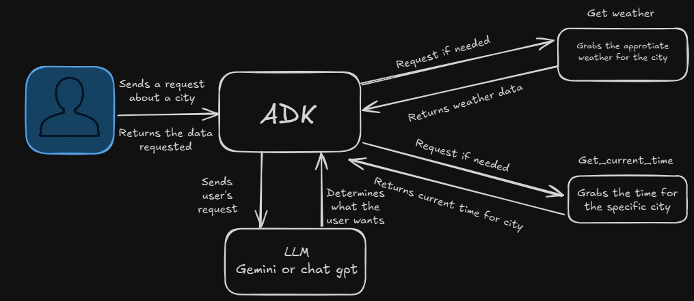

# 🤖 Multi_tool_agent

## 📄 Description
Multi_tool_agent is a hands-on, extensible AI agent project built as a continuation of [Google's official Agent Development Kit (ADK)](https://google.github.io/adk-docs/get-started/quickstart/#run-your-agent) tutorial. If you're just starting to explore how modern AI agents work—especially those capable of interacting with multiple tools—this repository serves as both a guided learning experience and a launchpad for your own experiments.

This project builds directly on Google’s foundational tutorial by implementing a functional multi-tool agent capable of retrieving weather and time data based on user input. While the original tutorial provides a great starting point, this version expands on it by introducing:

Support for multiple cities (more to be added over time).

Use of freely available APIs for data retrieval.

A lightweight structure for customizing tool behavior and agent responses.

💡 Note: This repo is meant for educational and experimental purposes. To keep things simple and cost-effective, only free APIs are used. Users are responsible for providing correctly spelled and valid city names when interacting with the agent.

Whether you're new to AI agents or looking to get more hands-on with multi-tool orchestration, this project is designed to be transparent, approachable, and easy to build upon.


## 🛠️ Prerequisites
Before you get started, make sure you have the following tools and libraries ready to go:

Python 3.10+

google-adk – the core Agent Development Kit provided by Google

LiteLLM – a lightweight abstraction layer for calling LLMs

🔧 For the most part these packages should be installed if you followed the intructions in the README file in the main folder [README.md](../README.md)

### 🔐 Environment Setup
To enable access to external tools and APIs, you’ll need to create a .env file at the root of your project. This file should include your API keys and configuration settings.

Here's a sample you need to copy and edit:

```env
GOOGLE_GENAI_USE_VERTEXAI=FALSE
GOOGLE_API_KEY=PASTE_YOUR_ACTUAL_API_KEY_HERE
```
⚠️ Make sure to replace PASTE_YOUR_ACTUAL_API_KEY_HERE with your real Google API key.

This file ensures your agent can properly authenticate and fetch data when using external tools like weather APIs.

## run
In order to run your model to need to run te command below; but because of the foldr structure you need to run the command in the main AIAgents folder

```terminal
adk run multi_tool_agent
```

## 🧠 Diagram

> A very basic architecture or flow diagram
> 



## 📚 References
If you want to dive deeper into google's agentic development kit I highly recommend visiting this website
[Googles adk](https://google.github.io/adk-docs/).

If you want more information on what AI agents are you can read this aritcle I wrote
[what is agentic ai and why it matters](https://medium.com/@lamcloudjr/what-is-agentic-ai-and-why-it-matters-ecf535ec54cf).

